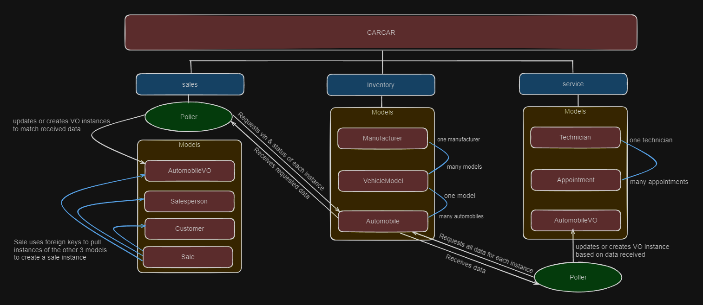

# CarCar

Team:

* Person 1 - Devin Matherne: Automobile Service
* Person 2 - Krystin Gonzales: Automobile Sales

## Design
CarCar is comprised of three microservices, Inventory, Service, and Sales. Service and Sales each interact with Inventory to execute their features.

How to run the project?
 - clone repository to local machine
    in terminal:
        git clone <<repository_url>>
 - build and run using Docker
    in terminal:
        docker volume create beta-data
        docker compose build
        --wait for build to complete--
        docker compose up
 - After all docker containers are running the project can be viewed on http://localhost:3000

Diagram of the Project:




## Inventory microservice
Models:
    Manufacturer: This defines the name of a manufacturer.

    VehicleModel: Defines the model name, a picture, and a manufacturer for each instance. The picture must be a url and the manufacturer is a foreignkey to the Manufacturer model.

    Automobile: Defines color, year, vin, sale status, and model for each instance. The vin is a unique identifier. the model is a foreign key to the VehicleModel model.

Insomnia endpoints:
    Inventory:
        GET: http://localhost:8100/api/automobiles/
        POST: http://localhost:8100/api/automobiles/
        PUT: http://localhost:8100/api/automobiles/<vin>
        DELETE: http://localhost:8100/api/automobiles/<vin>

<!--
        Post sample input:
        {
            "color":"Purple",
            "year":"2010",
            "vin":"1C3CC5FB2AN1273",
            "model_id": 1
        }
-->

    Models:
        GET: http://localhost:8100/api/models/
        POST: http://localhost:8100/api/models/
<!--
        POST sample input:
        {
            "name":"Mustang",
            "picture_url": "https://www.pexels.com/photo/blue-ford-mustang-in-car-park-10905506/",
            "manufacturer_id": 2
        }
-->

    Manufacturers:
        GET: http://localhost:8100/api/manufacturers/
        POST:http://localhost:8100/api/manufacturers/
<!--
        POST sample input:
        {
            "name": "Ford"
        }
-->


Front end paths:
    Inventory:
        List inventory: http://localhost:3000/automobiles
        Add to inventory: http://localhost:3000/automobiles/new

    Models:
        List or Add Model: http://localhost:3000/models

    Manufacturers:
        List or Add Manufacturer: http://localhost:3000/manufacturers

## Services microservice

Service Microservice has 3 models: Technician, Appointment, and AutomobileVO.

The Appointment Model uses the information from the other two models to view, edit, delete, and create new service appointments.

The AutomobileVO Model is a Value Object that pulls the automobile data from the inventory with a poller. The poller will automatically gather information from the inventory database every 60 seconds. This data is then used to verify if a car that is scheduled for service was purchased from this dealership so those customers can receive special VIP treatment.

### Ports:

Service-API Port: 8081


### URLS:

**Appointments URLs**

* GET (List View): "http://localhost:8081/api/appointments"
* POST (Create New Appointment): "http://localhost:8081/api/appointments/"
* PUT (Edit Existing Appointment): "http://localhost:8081/api/appointments/<int:pk>/"
* DELETE (Delete Appointment from Database): "http://localhost:8081/api/appointments/<int:pk>/"

```
Example Template to Create a New Appointment in Insomnia

{
	"date_time": "2024-02-18 12:00",
	"vin": "2D4RN4DG9BR787100",
	"customer": "Ann Perkins",
	"technician": "jdoe",
	"reason": "Oil Change"
}

Insomnia Response

{
	"appointment": {
		"id": 5,
		"date_time": "2024-02-18 12:00",
		"reason": "Oil Change",
		"status": "Scheduled",
		"vin": "2D4RN4DG9BR787100",
		"customer": "Ann Perkins",
		"technician": {
			"first_name": "John",
			"last_name": "Doe",
			"employee_id": "jdoe",
			"id": 3
		}
	}
}

```

**Technician URLs**

* GET (List View): "http://localhost:8081/api/technicians/"
* POST (Create New Technician): "http://localhost:8081/api/technicians/"
* DELETE (Delete Technician from Database): "http://localhost:8081/api/appointments/<int:pk>/"

```
Example Template to Create a New Technician in Insomnia

{
	"first_name": "Santa",
	"last_name": "Claus",
	"employee_id": "sclaus"
}

Insomnia Response

{
	"tech": {
		"first_name": "Santa",
		"last_name": "Claus",
		"employee_id": "sclaus",
		"id": 6
	}
}

```

## Sales microservice

Explain your models and integration with the inventory
microservice, here.

Models:
    There are 4 models for the Sales microservice:

    1. AutomobileVO: This defines how the data polled from Inventory should be represented as value objects for the sales microservice.

    2. Salesperson: This defines the data collected for each salesperson.

    3. Customer: This defines the data collected for each customer.

    4. Sale: The data for each sale instance is comprised of a price field as well as an instance of each of the other 3 models.

Insomnia endpoints:
    Salesperson:
        GET = http://localhost:8090/api/salespeople/
        POST = http://localhost:8090/api/salespeople/
        DELETE = http://localhost:8090/api/salespeople/<int:pk>/
<!--
        sample json for POST:
        {
            "first_name": "John",
            "last_name": "Doe",
            "employee_id": "555"
        }
-->

    Customer:
        GET = http://localhost:8090/api/customers/
        POST = http://localhost:8090/api/customers/

<!--
        sample json for POST:
        {
            "first_name": "Marie",
            "last_name": "Curie",
            "address": "1906 Radium Ln",
            "phone_number": 1234567
        }
-->


    Sale:
        GET = http://localhost:8090/api/sales/
        POST = http://localhost:8090/api/sales/

<!--
        {
            "automobile": "1C3CC5FB2AN1273", (vin)
            "salesperson": 111, (employee_id)
            "customer": 1, (customer id)
            "price": 8753 (integer)
        }
-->

    AutomobileVO:
        GET: http://localhost:8090/api/autoVO/

Front end paths:
    Salespeople:
        List salespeople: http://localhost:3000/salesperson
        Create salesperon: http://localhost:3000/salesperson/new

    Customers:
        List customers: http://localhost:3000/customers
        Add a customer: http://localhost:3000/customers/new

    Sales:
        List all sales: http://localhost:3000/sales
        List sales by employee: http://localhost:3000/sales/employee
        Create a new sale: http://localhost:3000/sales/new
